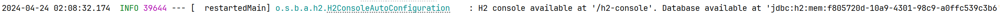

# commerce-submit

## 프로젝트 기술 스택

1. Java 8
2. Spring Boot 2.7.18
3. Gradle 8.6
4. Spring Data JPA
5. H2 2.1.214 (lastest) (local & test)

## H2 인메모리 db 콘솔에서 확인하는 방법

- 
- 어플리케이션 수행 후 콘솔에 노출되는 값을 URL 에 입력해야합니다.
- http://localhost:8080/h2-console 접속
- JDBC URL : jdbc:h2:mem:testdb:<고유값> url 입력
- User Name : sa
- Password :

## 스웨거 접속 방법

- http://localhost:8080/swagger-ui/index.html

## 프로젝트 실행 방법(개발툴)

1. 프로젝트를 클론합니다.
2. 프로젝트를 빌드합니다.
3. 프로젝트를 실행합니다.

```shell
git clone  "https://github.com/qkrtkdwns3410/commerce-submit.git"
./gradlew build
./gradlew bootRun
```

## .http client 사용법

1. 프로젝트 루트에 존재하는 api-request-test.http 파일을 엽니다.
2. http-client.env.json 을 적용해야하기에, intellij 에서 local 환경~~으로 설정해줍니다.
3. 원하는 api를 선택하고, Intellij에서 해당 api를 실행합니다.~~

## 패치 내역

1. 2024.04.25
    - 프로젝트 회원가입 API 응답 코드가 200으로 내려오고 있던 문제 201로 수정
    - 회원가입에 대한 통합 테스트 코드 작성 완료 ( 작성중에 응답 코드 문제 발견 )
    - 회원목록에 대한 통합 테스트 코드 작성 완료

2. 2024.04.26
   - 회원 수정에 대한 통합 테스트 코드 작성 완료
   - 테스크 클래스에 @DisplayName 추가
   - 회원 엔티티 수정에 대한 테스크 코드 추가